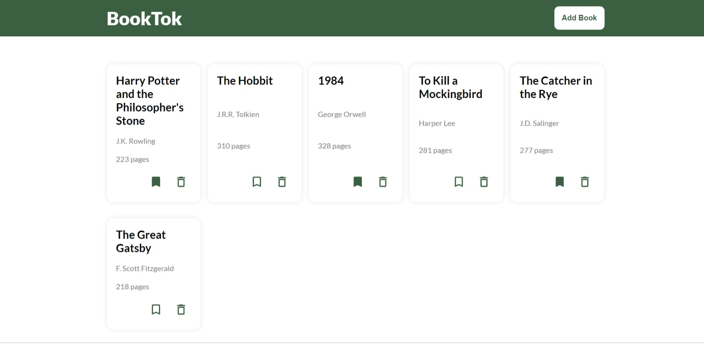

# Library Project

This is a **Library** project created as part of [The Odin Project](https://www.theodinproject.com/) JavaScript curriculum. The project focuses on building a web-based library app to manage a collection of books using JavaScript, HTML, and CSS.

## Features

- Add new books to the library by filling out a form.
- Mark books as **read** or **not read**.
- Remove books from the library.
- Books are dynamically displayed on the page using **JavaScript**.
- Simple and responsive design for usability on various devices.

## Project Preview



Try the live version of the project here: [Live Preview](https://gonalgar.github.io/library/)

## Technologies Used

- **HTML5**: Markup for the structure of the library app.
- **CSS3**: Styling for the layout and design.
- **JavaScript (ES6)**: Logic for managing the library collection, DOM manipulation, and event handling.

## Getting Started

To view or modify the project locally:

1. Clone this repository:
   ```bash
   git clone https://github.com/gonalgar/library.git
2. Navigate to the project directory:
    ```bash
    cd library
3. Open the index.html file in your browser to view the library.

## What I Learned
- Using JavaScript objects to manage a collection of data (books).
- Implementing constructors or classes for creating book objects.
- Dynamically updating the DOM to display and modify content.
- Handling user inputs and events to update the library.
- Designing a responsive layout using basic CSS.

## Acknowledgements
This project is part of [The Odin Project Intermediate HTML and CSS](https://www.theodinproject.com/paths/full-stack-javascript/courses/intermediate-html-and-css) curriculum. It provided a practical introduction to object manipulation, DOM interaction, and managing dynamic data in web applications.

## License
This project is open-source and available under the MIT License.